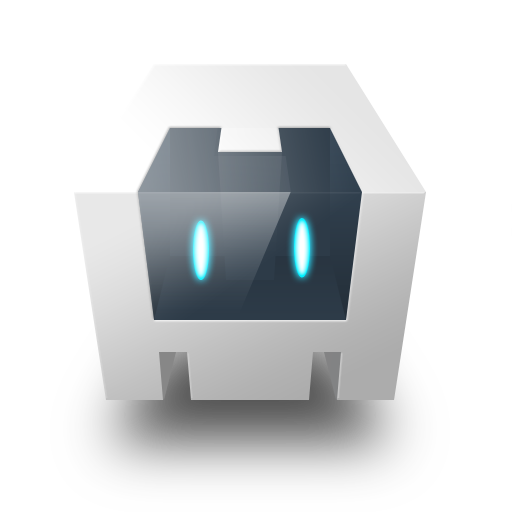

Atome
-

-

Cross platform ecosystem
-

- atome is a cross platform development framework, aim to build mobile or desktop applications, web site, games, presentations, and lots more...

- atome's applications can be deploy as a simple application, a client, a server or both, as well as be booted at startup (Operating System. mode)

- all apis work identically, to ensure you'll have the exact same rendering whatever the host platform (Android, Freebsd, linux, MacOs, Web, Windows).

- atome and all the included libraries are entirely open source with a very permissive MIT licence. it means you can do what you want want with it!

- the framework is totally hybrid, it can be executed as a full blown native application, a native application with a web view, in a web browser or a web view

- Atome can be used in stand alone (offline mode), in cloud mode or both and sync data when required

- it's also possible to publish websites on a static server (without server side language) while using a database and sync data between users

- Anything in atome can be scripted, even on the fly at runtime!

Open source technology included
-

- Ruby : is the language used to script all atome's apis (https://www.ruby-lang.org)

[comment]: <> ()

- Opal : is a ruby gem used to compile the ruby language to JS (https://opalrb.com)

[comment]: <> ()

- Roda : is a ruby web framework that push the server version of atome (https://roda.jeremyevans.net)

[comment]: <> ()

- Puma : is a ruby web server to start the backend of atome (https://puma.io)

[comment]: <> ()

- FreeBSD : is a Unix platform with a very secure environment (jails), allow to create and boot embedded applications on any compatible machine (standard PC, Raspberry, Beaglebone, etc..), while keeping a very small footprint using the nanoBSD facility of FreeBSD (https://www.freebsd.org/fr/)

[comment]: <> ()

- Tauri : Build smaller, faster, and more secure desktop applications with a web frontend.(https://github.com/tauri-apps/tauri)

[comment]: <> ()

&nbsp;&nbsp;&nbsp;&nbsp;&nbsp;

[//]: # (&nbsp;&nbsp;&nbsp;&nbsp;&nbsp;)
&nbsp;&nbsp;&nbsp;&nbsp;&nbsp;
&nbsp;&nbsp;&nbsp;&nbsp;&nbsp;
&nbsp;&nbsp;&nbsp;&nbsp;&nbsp;
&nbsp;&nbsp;&nbsp;&nbsp;&nbsp;
&nbsp;&nbsp;&nbsp;&nbsp;&nbsp;

## Installation

Install the gem and add to the application's Gemfile by executing:

    $ bundle add atome

If bundler is not being used to manage dependencies, install the gem by executing:

    $ gem install atome

## Usage

[Full documentation here](./documentation/atome.md)

## Development

After checking out the repo, run `bin/setup` to install dependencies. Then, run `rake test` to run the tests. You can also run `bin/console` for an interactive prompt that will allow you to experiment.

To install this gem onto your local machine, run `bundle exec rake install`. To release a new version, update the version number in `version.rb`, and then run `bundle exec rake release`, which will create a git tag for the version, push git commits and the created tag, and push the `.gem` file to [rubygems.org](https://rubygems.org).

## Contributing

Bug reports and pull requests are welcome on GitHub at https://github.com/atomecorp/atome. This project is intended to be a safe, welcoming space for collaboration, and contributors are expected to adhere to the [code of conduct](https://github.com/atomecorp/atome/blob/master/CODE_OF_CONDUCT.md).

## License

The gem is available as open source under the terms of the [MIT License](https://opensource.org/licenses/MIT).

## Code of Conduct

Everyone interacting in the Atome project's codebase, issue trackers, chat rooms and mailing lists is expected to follow the [code of conduct](https://github.com/atomecorp/atome/blob/master/CODE_OF_CONDUCT.md).

Example website:
-
**[a website showing some apis demo ](http://atome.one)**

Contact:
-
**[queries@atome.one](mailto:contact@atome.one)**

